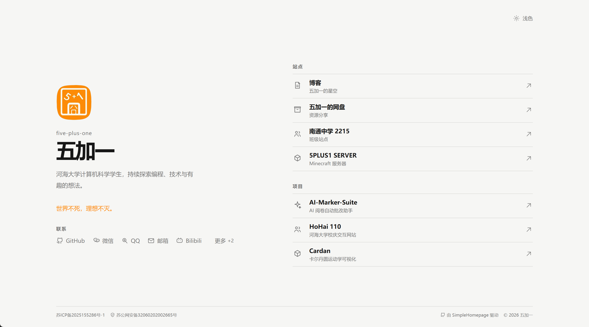
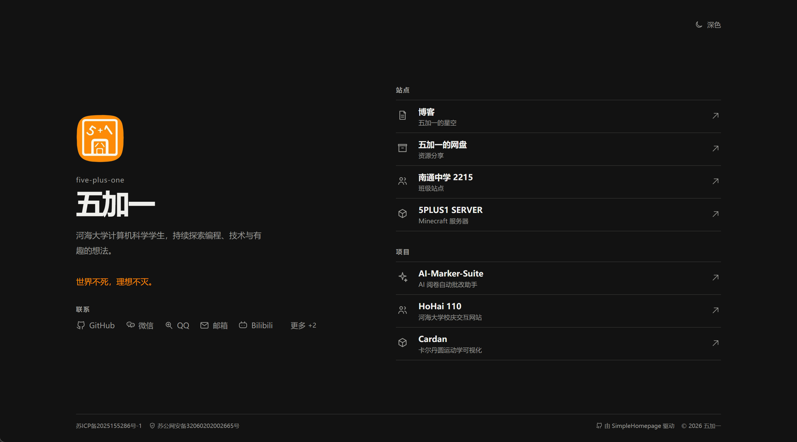

# Simple Homepage

以一屏呈现个人简介、站点、项目、社交账号与可选备案信息的静态个人主页。项目使用 Vite 构建，产物可直接部署到任意静态服务器。





## 使用

```bash
npm install
npm run dev
npm run build
```

构建完成后，上传 `dist/` 内的全部文件到任意静态托管服务即可。修改 `site.config.js` 即可替换页面内容；它是通用字段示例，组件不依赖示例人物资料。

详细字段说明、图片配置、图标扩展和部署注意事项请阅读 [配置指南](docs/CONFIGURATION.md)。

## 配置约定

- `siteName`：浏览器标签页与站点名称；未填写时使用姓名，不会强制添加产品名。
- `seo`：页面标题、描述、关键词、站点 URL 与分享图。构建时会写入 HTML 的 SEO 与 Open Graph 元信息，建议填写完整。
- `profile`：姓名、账号、头像与简介。`avatar` 可为单个 URL，也可分别填写 `light`、`dark` 两个 URL。
- `quotes`：一言列表；页面会以打字机效果轮播，用户偏好减少动态效果时展示第一条。
- `sites`、`projects`：紧凑链接列表，建议分别不超过 4、3 项，以保持一屏。
- `socials`：根据当前宽度自动完整展示或收纳到“更多”；不再依赖固定的常驻数量。
- `theme.accent`：唯一的用户主题色，分别设置浅色和深色值；默认 `system` 跟随浏览器。
- `compliance`：ICP备案及公网安备案均为可选；`label` 为空时不显示。
- `poweredBy`：可隐藏页脚的项目链接，但建议保留署名以支持项目。

### 本地头像与浏览器图标

将图片放在 `public/` 目录下，例如 `public/images/avatar-light.png`、`public/favicon.png`。它们会在构建时被复制到 `dist/`。配置使用相对项目根目录的 `./public/` 路径：

```js
profile: {
  avatar: {
    light: { local: "./public/images/avatar-light.png" },
    dark: { local: "./public/images/avatar-dark.png" },
  }
},
favicon: {
  light: { local: "./public/favicon-light.png" },
  dark: { local: "./public/favicon-dark.png" },
}
```

也可将 `{ local: ... }` 替换为 `{ url: "https://..." }`。浅深色素材相同时，两个字段填写同一路径即可。

项目中所有 UI 图标均为内置的原创单色 SVG 线稿，不需要下载图标库。

### 自定义平台图标

常用平台可直接使用内置 `icon` 名称。若需要更多平台，可在任意链接项中填写安全的 SVG 路径数据，页面会继承当前主题的单色风格：

```js
{
  label: "Mastodon",
  url: "https://example.com",
  icon: {
    viewBox: "0 0 24 24",
    paths: ["M6 4h12v16H6z", "M9 9v6M15 9v6"]
  }
}
```

该格式只接受 `viewBox` 和 `paths`，不会执行外部脚本或嵌入任意 SVG 标签。

## 压力测试

仅在开发模式下访问 `http://localhost:5173/?stress=1`，会临时追加 14 条超长名称的站点和项目，用于检查大量条目、超长文字与列表收纳。未超量分组在普通宽度下最多展示 4 项、窄屏最多展示 3 项；超过 4 项的分组仅展示 2 项，其余通过“查看全部”进入独立的可滚动列表。生产构建会强制关闭该模式：部署后的站点即使带上 `?stress=1` 也不会显示测试数据。

## 小高度视口

页面会尽量维持一屏；当 CSS 视口高度不足 700px（包括高 DPI 横屏设备）时，会自动改为自然页面滚动，优先保证内容、返回按钮和备案信息不被裁切或相互覆盖。
